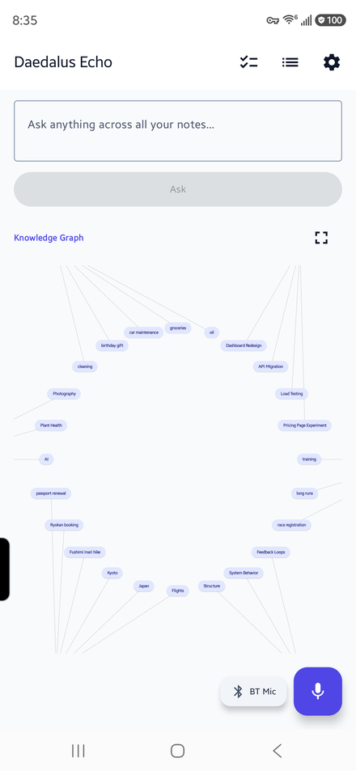
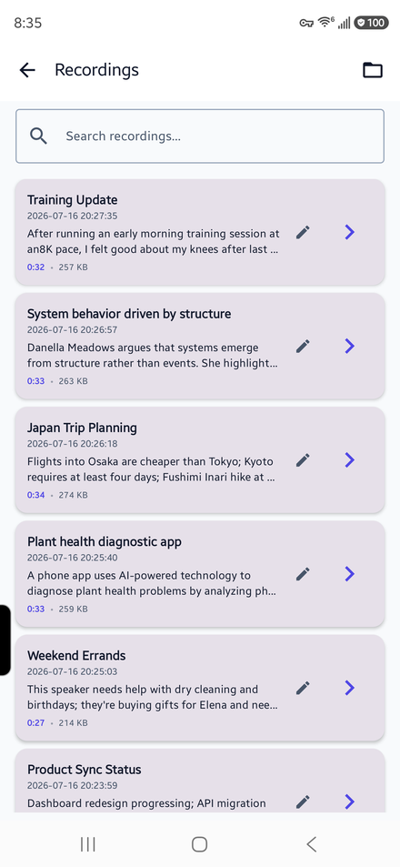
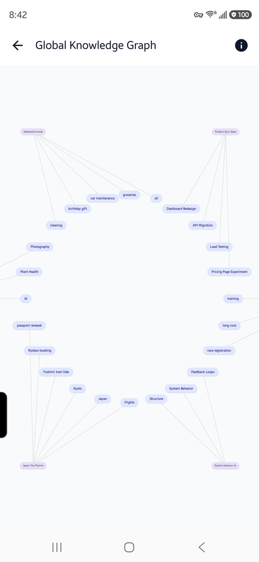

# Daedalus Echo
[](https://github.com/DaedalusApps/daedalus-echo/actions/workflows/ci.yml)

A standalone Android voice recorder, transcription, and AI analysis application. Records audio directly (using the built-in or Bluetooth microphone), transcribes recordings on-device with Whisper, generates smart summaries and interactive mind maps with Gemma 3, and lets you ask semantic questions across your entire library — all running 100% locally on-device.

**[Visit the project landing page](https://echo.daedalusapps.com)** · [Privacy Policy](https://echo.daedalusapps.com/privacy.html)

## Features

- **Local Voice Recording** — Record high-quality audio directly in the app using the device microphone or a Bluetooth headset (SCO)
- **On-Device Transcription** — Whisper base.en via sherpa-onnx; speech-to-text happens entirely offline and audio never leaves your phone
- **AI Analysis** — Gemma 3 1B generates a title, summary, key topics, and a structured mind map per recording
- **Ask Your Notes** — Semantic Q&A across your whole library: relevant recordings are retrieved by meaning, then Gemma synthesizes a detailed answer citing specific sources
- **Action Items** — AI extracts to-do items from your recordings and tracks them on a dedicated Todo screen
- **Knowledge Graph** — Visualize semantic connections and shared topics across all of your recordings
- **Full-Text Search** — Instantly search across all transcripts and summaries
- **Export** — Share your summaries, mind maps, and Q&A answers as Markdown or copy them to the clipboard

## Screenshots

<p float="left">
  
  
  
</p>

## Requirements

| | |
|---|---|
| **Hardware** | Standard Android device with built-in microphone (Bluetooth mic/headset optional) |
| **Android** | ARM64, API 26+ (Android 8.0) |
| **RAM** | 4 GB minimum (6 GB or more recommended for smooth execution) |
| **GPU** | Vulkan 1.1+ support recommended for GPU acceleration of Gemma 3 |
| **Storage** | ~700 MB free (Gemma 3 1B: ~555 MB · Whisper base.en: ~119 MB · text embedder: ~26 MB) |

### Device Compatibility

Since all processing is local, the app requires a modern processor and adequate memory. Generally, **any mid-range or flagship Android device released in 2019 or later** running Android 10+ with at least 4 GB of RAM is compatible.

Popular compatible device series include:
*   **Google Pixel**: Pixel 3/3 XL/3a (minimum), Pixel 4 and newer (recommended).
*   **Samsung Galaxy**:
    *   *S Series*: S9, S10, S20, S21, S22, S23, S24, S25 and newer.
    *   *Note Series*: Note 9, Note 10, Note 20 series.
    *   *A Series (Mid-range)*: A51, A52, A53, A54, A55, A71, A72, A73 and newer (6GB/8GB RAM models recommended).
    *   *Z Fold/Flip*: All models.
*   **OnePlus**: OnePlus 6T, 7, 8, 9, 10, 11, 12, 13 and newer.
*   **Xiaomi / Redmi / POCO**:
    *   *Xiaomi*: Mi 9, 10, 11, 12, 13, 14, 15 and newer.
    *   *Redmi Note*: Note 8 Pro, 9 Pro, 10 Pro, 11 Pro, 12 Pro, 13 Pro and newer.
    *   *POCO*: F3, F4, F5, F6, X3 Pro, X4 Pro, X5 Pro, X6 Pro.

*Tested and verified on Samsung Galaxy S24 Ultra (Android 16, 12 GB RAM).*

## Setup

1. Open the `android/` folder in Android Studio (Hedgehog or newer)
2. Build and run on your device, or via the command line:
   ```bash
   # Windows
   cd android && .\gradlew installDebug

   # macOS / Linux
   cd android && ./gradlew installDebug
   ```
3. On first launch the app will prompt you to download the AI models from Settings:
   - **Gemma 3 1B** (~555 MB) — on-device summarization and Q&A
   - **Whisper base.en** (~119 MB) — on-device speech-to-text
   - **Universal Sentence Encoder** (~26 MB) — on-device text embeddings for semantic Ask
4. Tap the record button on the home screen to start recording audio.

## How It Works

All audio recording and AI processing happens locally on your Android device:

```
[ Built-in / BT Mic ] ──Record──► Android app
                                      │
                                 Whisper STT
                                 (on-device)
                                      │
                                 Gemma 3 1B
                                 (on-device)
                                      │
                           Title · Summary · Topics
                                 Mind Map
```

No data is sent to external servers.

Beyond per-recording analysis, **Ask Your Notes** embeds every transcript on-device so you can query the whole library by meaning — the most relevant recordings are retrieved, then Gemma composes an answer and links back to its sources.

## Tech Stack

| Component | Technology |
|---|---|
| UI | Jetpack Compose + Material 3 |
| Architecture | MVVM · Room · StateFlow |
| On-device LLM | MediaPipe 0.10.35 + Gemma 3 1B (`.task` format) |
| Transcription | sherpa-onnx 1.13.2 + Whisper base.en int8 ONNX |
| Semantic search | MediaPipe Text Embedder + Universal Sentence Encoder |
| Audio Recording | AudioRecord + Bluetooth SCO support |
| Database | Room 2.6.1 + SQLite WAL |
| Build | AGP 8.7.3 · Kotlin 2.0.21 · JDK 21 |

## Building

Requires Android SDK 35 and JDK 21.

```bash
cd android
.\gradlew assembleDebug    # debug APK
.\gradlew assembleRelease  # release APK (ADB debug hooks disabled)
```

> [!NOTE]
> The first build downloads the prebuilt `sherpa-onnx` Android library (~56 MB) from GitHub Releases into `app/libs/` automatically (the `downloadSherpaOnnx` Gradle task), so an internet connection is required for the initial build.
> 
> ADB broadcast commands (`ANALYZE`, `SYNC`, etc.) are only active in debug builds and are disabled in release builds.

## License

MIT
